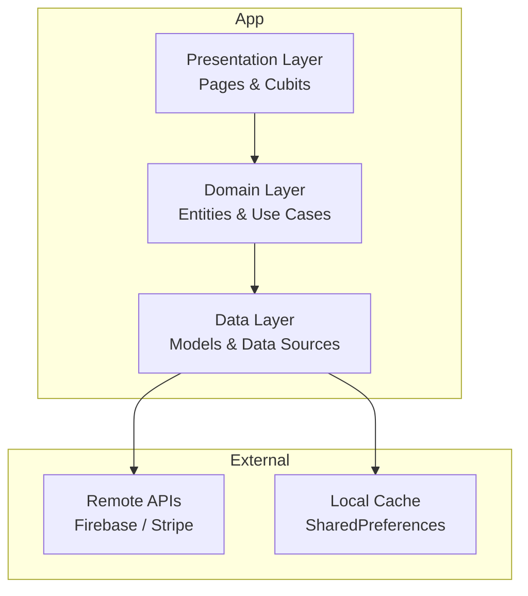

# E-Commerce Flutter Application
[](https://deepwiki.com/ahmedshaban-blip/CodeAlpha_E-Commerce-Application)

A complete, cross-platform e-commerce application built with Flutter. This project demonstrates a modern approach to mobile app development using Clean Architecture, Cubit for state management, and integration with essential services like Firebase for authentication and Stripe for payments.

## ✨ Features

- **Splash & Onboarding:** A smooth and welcoming introduction for new users.
- **Firebase Authentication:** Secure user registration and login functionality.
- **Dynamic Product Catalog:** Browse products by categories, including Electronics, Jewelry, Men's, and Women's Clothing.
- **Product Details:** View comprehensive information, images, and pricing for each product.
- **Shopping Cart:** Easily add, remove, and update the quantity of products in the cart.
- **Secure Checkout:** A seamless and secure payment process powered by Stripe.
- **Order Confirmation:** A "Thank You" page to confirm successful transactions.
- **User Profile & Settings:** Manage user information, change passwords, and toggle app themes.
- **Dual Themes:** Supports both light and dark modes for a comfortable user experience.
- **Localization:** Support for English and Arabic languages.

## 🏗️ Architecture

The application is structured using the principles of **Clean Architecture** to ensure a scalable, maintainable, and testable codebase. The project is divided into a `core` directory for shared functionalities and `features` directories for each distinct business logic module.

Each feature module is separated into three primary layers:
-   **Presentation:** Handles the UI (Pages/Screens) and state management (with Cubits).
-   **Domain:** Contains the core business logic, including entities, use cases, and abstract repository definitions.
-   **Data:** Implements the domain's repository interfaces and manages data retrieval from remote APIs and local sources.



## 🛠️ Tech Stack & Key Packages

| Category | Technology / Package |
| :--- | :--- |
| **Framework & Language** | Flutter, Dart |
| **Architecture** | Clean Architecture |
| **State Management** | `flutter_bloc` / `cubit` |
| **Backend & Auth** | Firebase Authentication |
| **Payment Gateway** | `flutter_stripe` |
| **Networking** | `dio` |
| **Routing** | Custom `AppRouter` |
| **Dependency Injection** | `get_it` |
| **Localization** | `easy_localization` |
| **Local Storage** | `shared_preferences` |
| **UI & UX Helpers** | `flutter_screenutil`, `google_fonts`, `animate_do` |

## 📱 Screenshots

| Splash| Home | Category|
| :---: | :---: | :---: |
|  |  |  |
| **Cart** | **Payment Confirmation** | **Payment Method** |
|  |  |  |

## 🚀 Getting Started

Follow these instructions to get a copy of the project up and running on your local machine for development and testing purposes.

### Prerequisites

-   Flutter SDK (v3.0.0 or higher)
-   A configured Firebase project
-   A Stripe account for payment processing

### Installation

1.  **Clone the repository**
    ```sh
    git clone https://github.com/ahmedshaban-blip/CodeAlpha_E-Commerce-Application.git
    cd CodeAlpha_E-Commerce-Application
    ```

2.  **Install dependencies**
    ```sh
    flutter pub get
    ```

3.  **Set up Firebase**
    -   Run `flutterfire configure` to generate your `firebase_options.dart` file.
    -   For Android, place your `google-services.json` file in `android/app/`.
    -   For iOS, add your `GoogleService-Info.plist` file to `ios/Runner/`.

4.  **Set up Environment Variables**
    -   Create a `.env` file in the project's root directory.
    -   Add your Stripe API keys to this file:
      ```env
      publishable_key=YOUR_STRIPE_PUBLISHABLE_KEY
      secret_key=YOUR_STRIPE_SECRET_KEY
      ```

5.  **Run the app**
    ```sh
    flutter run
    ```

## 📁 Project Structure

The `lib` directory is organized to support a clean and scalable architecture.

```
lib/
├── app.dart                   # Main application widget
├── app_bloc_observer.dart     # BLoC observer for state changes
├── main.dart                  # Application entry point
├── core/                      # Shared code: services, utils, themes
│   ├── constants/
│   ├── cubit/
│   ├── errors/
│   ├── network/
│   ├── routing/
│   ├── services/
│   └── theme/
└── features/                  # Feature-based modules
    ├── login/
    │   ├── data/
    │   ├── domain/
    │   └── presentation/
    ├── home/
    │   ├── data/
    │   ├── domain/
    │   └── presentation/
    ├── cart/
    │   ├── data/
    │   ├── domain/
    │   └── presentation/
    └── ... (other features like profile, checkout, etc.)
```
