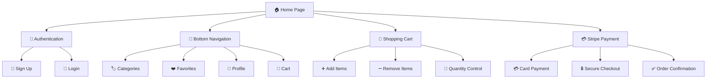
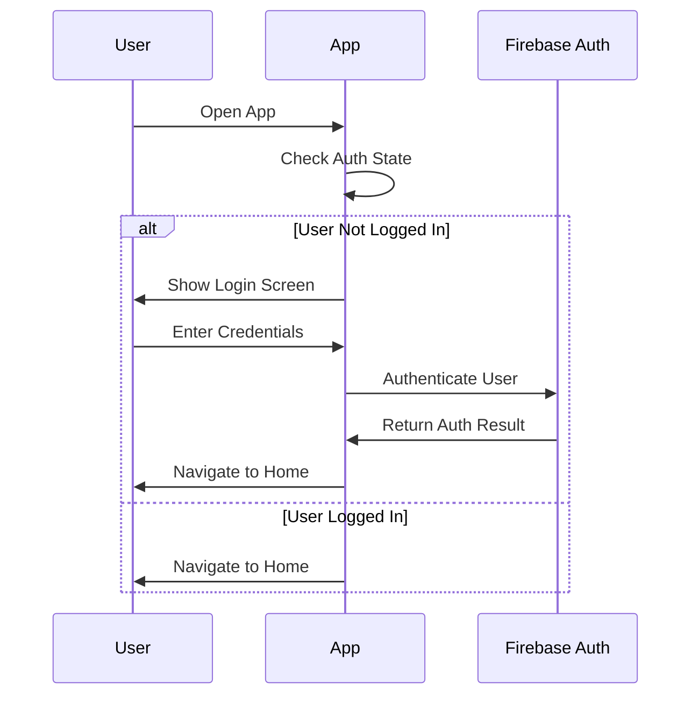
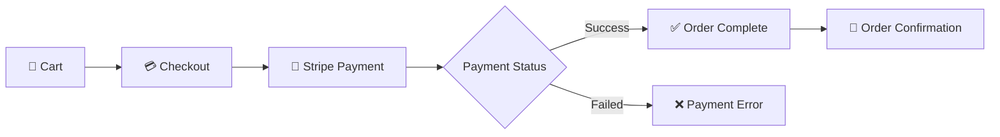
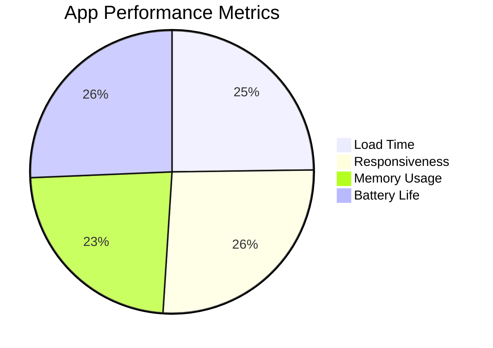

# 🛍️ Flutter E-Commerce App

<div align="center">
  
  
  
  
</div>

<div align="center">
  <h3>🚀 A Modern Flutter E-Commerce Application</h3>
  <p>Complete shopping experience with authentication, categories, cart, and payment integration</p>
</div>

---

## 📱 Features



## 🏗️ Architecture Overview

```
┌─────────────────────────────────────────┐
│                UI Layer                 │
├─────────────────────────────────────────┤
│  📱 Pages & Widgets                     │
│  • LoginPage                           │
│  • SignUpPage                          │
│  • HomePage                            │
│  • CartPage                            │
│  • CategoryPages                       │
└─────────────────────────────────────────┘
                    │
┌─────────────────────────────────────────┐
│             Business Logic              │
├─────────────────────────────────────────┤
│  🔧 Cubit & State Management        │
│  • AuthProvider                        │
│  • CartProvider                        │
│  • ProductProvider                     │
└─────────────────────────────────────────┘
                    │
┌─────────────────────────────────────────┐
│               Data Layer                │
├─────────────────────────────────────────┤
│  🗄️ Services & APIs                     │
│  • Firebase Auth                       │
│  • Firestore Database                  │
│  • Stripe Payment                      │
└─────────────────────────────────────────┘
```

## 🛠️ Tech Stack

<table>
<tr>
<td>

**Frontend**
- 🎨 Flutter 3.16+
- 🎯 Dart 3.0+
- 🔄 Provider (State Management)
- 🎪 Animations & Transitions

</td>
<td>

**Backend & Services**
- 🔥 Firebase Authentication
- 📊 Cloud Firestore
- 💳 Stripe Payment Gateway
- 📱 Push Notifications

</td>
</tr>
</table>

## 📦 Dependencies

```yaml
dependencies:
  flutter:
    sdk: flutter
  
  # State Management
  provider: ^6.1.1
  
  # UI Components
  cupertino_icons: ^1.0.6
  google_fonts: ^6.1.0
  flutter_svg: ^2.0.9
  cached_network_image: ^3.3.0
  
  # Navigation
  go_router: ^12.1.3
  
  # Firebase
  firebase_core: ^2.24.2
  firebase_auth: ^4.15.3
  cloud_firestore: ^4.13.6
  
  # Payment
  stripe_flutter: ^10.1.1
  
  # Utilities
  shared_preferences: ^2.2.2
  connectivity_plus: ^5.0.2
  image_picker: ^1.0.4
  
dev_dependencies:
  flutter_test:
    sdk: flutter
  flutter_lints: ^3.0.1
  build_runner: ^2.4.7
```

## 🚀 Getting Started

### Prerequisites

- 📱 Flutter SDK (3.16.0 or later)
- 🎯 Dart SDK (3.0.0 or later)
- 🔥 Firebase Project Setup
- 💳 Stripe Account

### Installation

1. **Clone the repository**
   ```bash
   git clone https://github.com/yourusername/flutter-ecommerce-app.git
   cd flutter-ecommerce-app
   ```

2. **Install dependencies**
   ```bash
   flutter pub get
   ```

3. **Firebase Configuration**
   ```bash
   # Install Firebase CLI
   npm install -g firebase-tools
   
   # Login to Firebase
   firebase login
   
   # Configure FlutterFire
   dart pub global activate flutterfire_cli
   flutterfire configure
   ```

4. **Stripe Configuration**
   ```dart
   // lib/config/stripe_config.dart
   class StripeConfig {
     static const String publishableKey = 'pk_test_your_publishable_key';
     static const String secretKey = 'sk_test_your_secret_key';
   }
   ```

5. **Run the app**
   ```bash
   flutter run
   ```

## 📱 App Structure

```
lib/
├── 📁 config/
│   ├── stripe_config.dart
│   └── firebase_config.dart
├── 📁 models/
│   ├── user_model.dart
│   ├── product_model.dart
│   └── cart_model.dart
├── 📁 providers/
│   ├── auth_provider.dart
│   ├── cart_provider.dart
│   └── product_provider.dart
├── 📁 services/
│   ├── auth_service.dart
│   ├── firestore_service.dart
│   └── stripe_service.dart
├── 📁 screens/
│   ├── auth/
│   │   ├── login_page.dart
│   │   └── signup_page.dart
│   ├── home/
│   │   ├── home_page.dart
│   │   └── category_page.dart
│   ├── cart/
│   │   ├── cart_page.dart
│   │   └── checkout_page.dart
│   └── profile/
│       └── profile_page.dart
├── 📁 widgets/
│   ├── custom_button.dart
│   ├── product_card.dart
│   └── bottom_nav_bar.dart
├── 📁 utils/
│   ├── constants.dart
│   ├── helpers.dart
│   └── validators.dart
└── main.dart
```

## 🎨 UI/UX Features

### 🔐 Authentication Flow


### 🛒 Shopping Cart System
- ➕ Add products to cart
- ➖ Remove products from cart
- 🔢 Adjust quantities
- 💰 Calculate totals
- 💾 Persistent cart storage

### 💳 Payment Integration


## 🏪 Product Categories

<div align="center">

| 👕 Fashion | 📱 Electronics | 🏠 Home & Garden | 🎮 Sports & Games |
|:---------:|:-------------:|:----------------:|:----------------:|
| Clothing  | Smartphones   | Furniture        | Gaming           |
| Shoes     | Laptops       | Decor            | Fitness          |
| Accessories| Tablets      | Kitchen          | Outdoor          |

</div>

## 🔧 Configuration Files

### Firebase Configuration
```json
{
  "project_info": {
    "project_number": "your_project_number",
    "project_id": "your_project_id",
    "storage_bucket": "your_project_id.appspot.com"
  },
  "client": [
    {
      "client_info": {
        "mobilesdk_app_id": "your_app_id",
        "android_client_info": {
          "package_name": "com.example.ecommerce_app"
        }
      }
    }
  ]
}
```

### Stripe Configuration
```dart
class StripeConfig {
  static const String publishableKey = 'pk_test_...';
  static const String merchantId = 'merchant.com.example.app';
  static const String urlScheme = 'flutterstripe';
}
```

## 🧪 Testing

```bash
# Run unit tests
flutter test

# Run integration tests
flutter test integration_test/

# Run widget tests
flutter test test/widget_test.dart
```

## 📊 Performance Metrics

<div align="center">



</div>

## 🔒 Security Features

- 🔐 Firebase Authentication
- 🛡️ Secure API endpoints
- 💳 PCI-compliant payments
- 🔒 Data encryption
- 🚫 Input validation

## 📱 Screenshots


<div align="center">  
  <table>  
    <tr>  
      <td></td>  
      <td></td>  
      <td></td>  
      <td></td>  
    </tr>  
    <tr>
      <td></td>
      <td></td>
      <td></td>
    </tr>
  </table>  
</div>

## 🤝 Contributing

We welcome contributions! Please see our [Contributing Guidelines](CONTRIBUTING.md) for details.

```mermaid
gitgraph
    commit id: "Initial commit"
    branch feature/auth
    checkout feature/auth
    commit id: "Add authentication"
    checkout main
    merge feature/auth
    branch feature/cart
    checkout feature/cart
    commit id: "Add shopping cart"
    checkout main
    merge feature/cart
    commit id: "Release v1.0"
```

## 📄 License

This project is licensed under the MIT License - see the [LICENSE](LICENSE) file for details.

## 🆘 Support

- 📧 Email: ahmed.shabaan.dev@gmail.com
- 💬 Discord: [Join our community]()

## 🔄 Changelog

### Version 1.0.0 (Latest)
- ✅ User authentication (Login/Signup)
- ✅ Home page with bottom navigation
- ✅ Four product categories
- ✅ Shopping cart functionality
- ✅ Stripe payment integration
- ✅ Responsive design
- ✅ State management with Provider

### Upcoming Features
- 🔄 User profiles and preferences
- 🔄 Product reviews and ratings
- 🔄 Order history and tracking
- 🔄 Push notifications
- 🔄 Dark mode support

---

<div align="center">
  <h3>Made with ❤️ using Flutter</h3>
  <p>⭐ Star this repo if you found it helpful!</p>
  
  
  
  
  
  
</div>
